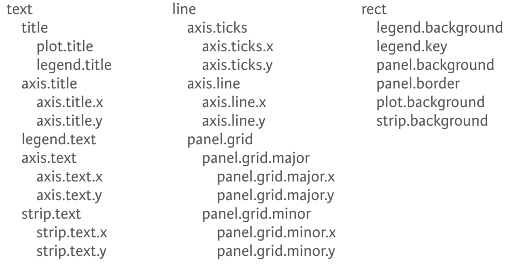

## About me

.left-column[
```{r, oluwafemi,fig.align='left',fig.height=4,fig.width=7,echo=FALSE,message=FALSE,warning=FALSE}

```
]

.right-column[

- I am a Agrometeorologist and Crop Simulation modeler

- I am a member of R4DS online learning community

- I am also a active member of the TidyTuesday project

- I love reading books in my spare time

- `r fontawesome::fa("linkedin")`: [Oluwafemi Oyedele](https://www.linkedin.com/in/oluwafemioyedele/) 

- `r fontawesome::fa("twitter")`: [@OluwafemOyedele](https://twitter.com/OluwafemOyedele) `r emoji::emoji("thumbsup")`

- `r fontawesome::fa('github')`:
[https://github.com/BB1464/R-Ladies-Abuja](https://github.com/BB1464/R-Ladies-Abuja)

- `r fontawesome::fa("globe")`: [https://statisticalinference.netlify.app](https://statisticalinference.netlify.app) `r emoji::emoji("smile")`

]
---

# **Agenda**

- Introduction to the Grammar of Graphics

- We will be looking at the different layers that is in ggplot2

- The focus of this talk will be on the 20% that is useful 80% of the time

- More in-depth coverage is available via resources I will release later.
  
- **My goal is to make you excited about ggplot2!**


- I will entertain **questions** at the end


- **Github link to get the materials**: https://github.com/BB1464/R-Ladies-Abuja

---
# Grammar of Graphics
.pull-right[]
.pull-left[

- First published in 1999

- A theoretical deconstruction of data graphics

- Foundation for many graphic applications

- The Grammar of Graphics can be applied to every type of plot

- Concisely describe components


.pull-left[]
]
---
# Grammar of Graphics

---
# Grammar of Graphics
.pull-right[]

- Your dataset

- Tidy format

- There is no visualization without a dataset

---
# Grammar of Graphics
.pull-right[]

- **Aesthetics mapping**: links variable in the data to graphical properties in the geometry.

- We can specify the following properties within the aestetic mapping (colour, shape, alpha, fill, size).

---
# Grammar of Graphics
.pull-right[]

- Even tidy data may need some transformation

- The statistics is linked to the geometry

- Transform input variables to displayed values:
  
  - Bins for histogram
  
  - Summary statistics for boxplot using `stat_boxplot()`
  
  - No. of observations in a category for bar chart `stat_count`
  
- It is implicit in many plot-types but they can be done prior to plotting.
---
# Grammar of Graphics
.pull-right[]

-  Scales also provide the tools that let you interpret the plot: the axes and legends.


- Scales help us to control the mapping from data to aesthetics


- Understanding the underpinning of scales will help us to customize our visualization

- Scales are automatically generated in ggplot and can be customized
  
  - log scale
  
  - We can also specify limit within the scale


- Scales help you interpret the plot
  - Categories -> color
  - Numeric -> position

---
# Grammar of Graphics
.pull-right[]

- Geometries help us to interpret the aesthetics as graphical representation

- Determines your plot type
  - bar chart
  - scatter
  - box plot
  - histogram
  - ...
---

# Grammar of Graphics
.pull-right[]

- Divide your data into panels using one or two groups

- Allows you to look at smaller subsets of data

---
# Grammar of Graphics
.pull-right[]

- A coordinate system, maps the position of objects onto the plane of the plot.

- It is also the physical mapping of the aesthetics to the paper

- Coordinate systems affect all position variables simultaneously and differ from scales in that they also change the appearance of the geometric objects.

- Coordinate systems control how the axes and grid lines are drawn.

---
# Grammar of Graphics
.pull-right[]

- This controls the overall look of the plot

- Spans every part of the graphic that is not linked to the data

- Themes give you control over things like fonts, ticks, panel strips, and backgrounds
---


---
# Packages Used Today

This workshop focuses on data visualization with  [`ggplot2`](https://ggplot2.tidyverse.org).

--

`ggplot2` is a system for creating graphics, based on The Grammar of Graphics. You provide the data, tell `ggplot2` how to map variables to `aesthetics`, what graphical primitives to use, and it takes care of the details.


--

You can install `ggplot2` with the following:

```{r, eval=FALSE}
install.packages("ggplot2")
```

 Or the development version from GitHub:

```{r,eval=FALSE}
install.packages("devtools")
```

```{r,eval=FALSE}
devtools::install_github("tidyverse/ggplot2")
```

```{r load}
library(ggplot2)
```

---
- `The Data Layer` specifies the data being plotted
.center[

]

```{r,fig.align='center',fig.height=3,fig.width=12}
                   head(iris,2)
```

```{r,fig.align='center',fig.height=3,fig.width=10}
                 ggplot(data = iris)
```
---
# Aestetic Mapping

- `Aestetic Mapping`: This layer specifies how we want to map our data onto the scales of the plot

- To set a geometric property manually, place it outside of `aes()`

- The name of a color as a character string

- The size of a point

- The shape of a point as a number

---
- `Aestetic` properties in R
```{r,fig.align='center',fig.width=12,fig.height=5,echo=FALSE}
knitr::include_graphics(path = 'img/common-aesthetics-1.png')
```
---
- Shapes that are available in R
```{r,fig.align='center',fig.width=16,fig.height=8,echo=FALSE}
knitr::include_graphics(path = 'img/shapes-1.png')
```
---
```{r,fig.align='center',fig.height=6,fig.width=12}
                    ggplot(data = iris,
                    mapping = aes(
                     x = Sepal.Length,
                     y =  Sepal.Width,
                     colour=Species,shape=Species),
                     alpha=0.5
                      ) 
```
---
# Geoms
`ggplot2` has 53 `geoms` at the moments but we are going to look at just few geoms today. But I will release some useful resources at the end where you can learn further on what is not covered here.
- We can view all the geoms with this function below
```{r}
apropos('^geom_')
```
---
# Scatter plot
```{r,fig.align='center',fig.height=5,fig.width=12}
                    ggplot(data = iris,
                    mapping = aes(
                     x = Sepal.Length,
                     y =  Sepal.Width,
                     colour=Species,shape=Species),
                     alpha=0.5
                      )+
                     geom_point()
```
---
- Removing the colour from the mapping
```{r,fig.align='center',fig.height=5,fig.width=12}
                 ggplot(data = iris,
       mapping = aes(
           x = Sepal.Length,
           y =  Sepal.Width,shape=Species))+
    geom_point(colour='blue')
```
---
```{r,fig.align='center',fig.width=1,fig.height=1,echo=FALSE}
knitr::include_graphics(path = 'img/tom_need1.png')
```
---
```{r,fig.align='center',fig.width=12}
ggplot(data=faithful) + 
  geom_point(aes(x = eruptions, y = waiting, colour = eruptions < 3))
```
---
# Bar plot
```{r,fig.align='center',fig.height=5,fig.width=12}
                    ggplot(data = iris,
                    mapping = aes(
                     x = Species,
                     fill=Species)
                      )+
                     geom_bar(width = 0.7)
```
---
# Bar plot
```{r,error=TRUE,fig.align='center',fig.height=5,fig.width=12}
                    ggplot(data = iris,
                    mapping = aes(
                     x = Species,
                     y= Sepal.Length,
                     fill=Species)
                      )+
                     geom_bar(width = 0.9)
```
---
- This shows the proportion for each cut
```{r,fig.align='center',fig.height=8,fig.width=12}
ggplot(data = diamonds,mapping = aes(x = color,y=price,fill=cut))+
  geom_col(position = 'fill')
```
---
- This shows the proportion of the cut
```{r,fig.align='center',fig.height=8,fig.width=12}
ggplot(data = diamonds,mapping = aes(x = reorder(color,price,FUN=mean),y=price,fill=cut))+
  geom_bar(stat='summary',fun=mean)+xlab('Diamond quality')
```

---
# Box plot `geom_boxplot()`
```{r,fig.align='center',fig.height=5,fig.width=12}
                   ggplot(data = iris,
                    mapping = aes(
                     x = Species,
                     y =  Sepal.Width,
                     fill=Species))+
                      geom_boxplot()+geom_jitter()+
                      stat_summary(fun = mean,geom =             
                      'point',shape=23,fill='white',size=2.5)
```
---
# Histogram : `geom_histogram`
```{r,fig.align='center',fig.height=5,fig.width=12}
                   ggplot(data = iris)+
                   geom_histogram(
                     mapping = aes(x = Sepal.Length,fill=Species)
                     )
```
---
- Default behavior of `goem_histogram` is equivalent to the following.
```{r,fig.align='center',fig.height=6,fig.width=12}
ggplot(iris, aes(x = Sepal.Length, y = after_stat(count),fill=Species)) + geom_histogram()
```
---
- line graph with`stat_summary`
```{r,fig.width=12,fig.align='center',fig.height=6}
ggplot(data = economics,mapping = aes(x = date,y = uempmed))+
  stat_summary(fun = mean,geom = 'line')
```
---
# Density plot
```{r,fig.height=6,fig.width=12,fig.align='center'}
ggplot(diamonds, aes(depth, fill = cut, colour = cut)) +
  geom_density(alpha = 0.2, na.rm = TRUE)
```
---
# Violin plot
```{r,fig.height=6,fig.width=12,fig.align='center'}
ggplot(data = iris,mapping = aes(x = Sepal.Length,y = Petal.Length,fill=Species))+geom_violin()
```
---
- `Statistics`

- Statistical transformations,  summaries the data: for example, binning and counting observations to create a histogram, or fitting a linear model.

- The statistics layer allows you plot statistical values calculated from the data

- The function below shows the number of statistics available in ggplot2
```{r}
apropos('^stat_')
```
---
`Statistics`:`stat_boxplot`
```{r,fig.align='center',fig.height=4,fig.width=12}
                   ggplot(data = iris,
                    mapping = aes(
                     x = reorder(Species,Sepal.Width,FUN=median),
                     y =  Sepal.Width,
                     fill=Species))+
                      stat_boxplot(geom = 'errorbar')+
                      geom_boxplot(notch = TRUE)+geom_jitter()+
                      stat_summary(fun = mean,geom =             
                      'point',shape=23,fill='white',size=2.5)+xlab('Species')
```
---
- Statistical Transformation for bar plot
```{r,fig.align='center',fig.width=12,fig.height=5,echo=FALSE}
knitr::include_graphics(path = 'img/visualization-stat-bar.png')
```

- You can find out which `stat` each `geom` uses by looking at the default value of the `stat` argument of the help page.

- What it the default `stat` for `geom_bar`?
---
- Values calculated by the stat is available with the `after_stat()` function 
inside `aes()`. You can do all sorts of computations inside that.

```{r,fig.align='center',fig.width=12,fig.height=6}
ggplot(mpg) + 
  geom_bar(aes(x = class, y = after_stat(100 * count / sum(count))))
```
---
- `after_scale` function
```{r,fig.align='center',fig.width=12,fig.height=6}
   ggplot(mpg, aes(class, hwy)) +
  geom_boxplot(aes(fill = stage(class, after_scale = alpha(fill, 0.4))))
```
---
- Bar plot with error bars to show the level of uncertainty around the mean
```{r,fig.align='center',fig.height=4,fig.width=12}
                          ggplot(data=diamonds,aes(x = cut, y = price)) +
                          stat_summary(
                          geom = "bar",
                          fun = "mean",
                          alpha = .6
                          ) +
                          stat_summary(
                          geom = "errorbar",
                          fun.data = "mean_se",
                          width = .2
                          ) +
                         stat_summary(
                         geom = "point",
                         fun = "mean"
                         )
```
---
- Scatter plot showing the mean data point in red
```{r,fig.align='center',fig.height=6,fig.width=12}
ggplot(mpg)+
  geom_jitter(mapping = aes(x = class,y = hwy),width = 0.2)+
  stat_summary(mapping = aes(x = class,y=hwy),fun = mean,geom='point',colour='red')
```
---
- Here I added the best fit line alongside with the 95% confidence interval
```{r, fig.width=12, fig.height=6,fig.align='center'}
ggplot(mpg, aes(x = cty, y = displ)) +
    geom_point(alpha = 0.4, size = 2) +
    scale_x_log10() + geom_smooth(method = "lm")
```
---
```{r, fig.width=12, fig.height=6,fig.align='center'}
iris |>
  ggplot(aes(x = Species,
             y = Sepal.Length))+
  stat_summary(geom = 'pointrange',fun.max = max,fun.min = min,fun = mean)
```
---
# `Scales`

- `Scales` in ggplot2 control the mapping from data to aesthetics. They take your data and turn it into something that you can see, like size, colour, position or shape. 

- `Scales` also provide the tools that let you interpret the plot: the axes and legends. You can generate plots with ggplot2 without knowing how scales work, but understanding scales and learning how to manipulate them will give you much more control.

---
 - `ggplot2 has a total of 122 scales` but hear I choose to only show the first 50.

```{r Apros}
apropos('^scale_')|> head(n=50)
```
---
# `Modifying scales`
- A scale is required for every aesthetic used on the plot. When you write:
 
```{r,fig.align='center',fig.height=6,fig.width=12}
                   ggplot(mpg, aes(displ, hwy)) + 
                   geom_point(aes(colour = class))
```
---
 `What actually happens is this:`
```{r,fig.align='center',fig.height=6,fig.width=12}
                   ggplot(mpg, aes(displ, hwy)) + 
                    geom_point(aes(colour = class)) +
                    scale_x_continuous() + 
                    scale_y_continuous() + 
                    scale_colour_discrete()
```
---
`placing the x axis on log10`
```{r,fig.align='center',fig.height=6,fig.width=12}
                 ggplot(mpg, aes(displ, hwy,colour=class)) + 
                 geom_point() + 
                 scale_x_log10()
```
---
`Modifying the colour of the scatter plot using scale_colour_discrete`
```{r,fig.align='center',fig.height=6,fig.width=12}
           ggplot(data = mpg,mapping = aes(x = displ,y = hwy,colour=class))+
           geom_point()+
           scale_color_brewer(name='Class',palette = 'Set1')
```
---
- Here I specified that the type should be qualitative but we can also use sequencial or diverging
```{r,fig.align='center',fig.height=6,fig.width=12}
ggplot(mpg) + 
  geom_point(aes(x = displ, y = hwy, colour = class)) + 
  scale_colour_brewer(type = 'qual')
```
---
`Modifying the colour of the bar plot`
```{r,fig.align='center',fig.height=6,fig.width=12}
          ggplot(data = iris, mapping = aes(x = Species,fill=Species)) +
          geom_bar()+
          scale_fill_brewer(name='Species',palette = 'Dark2')
```
---
- Here I placed the y axis on log 10 and then I specified the breaks for the y axis
```{r,fig.align='center',fig.height=6,fig.width=12}
ggplot(mpg) + 
  geom_point(aes(x = displ, y = hwy)) + 
  scale_x_continuous(breaks = c(3, 5, 6)) + 
  scale_y_continuous(trans = 'log10')
```

---
`How to supply manual colour to ggplot2`
```{r,fig.align='center',fig.height=6,fig.width=12}
          ggplot(data = mpg,mapping = aes(x = displ,y = hwy,colour=class))+
          geom_point()+
         scale_colour_manual(name='Class',values =                      
                               c('red','blue','green','cyan',
                                                                     
                                 'gray50','pink','black'))
```
---
`How to creat breaks in the x axis`
```{r,fig.align='center',fig.height=6,fig.width=12}
ggplot(data = economics,mapping = aes(x = date,y = unemploy))+
  geom_line()+
  scale_x_date(date_breaks = '10 years')
```
---
- Supplying labels to the x axis 
```{r,fig.align='center',fig.height=6,fig.width=12}
      ggplot(data = iris, mapping = aes(x =Species,fill=Species))+
      geom_bar()+
      scale_fill_brewer(name='Species',palette='Dark2')+
      scale_x_discrete(name='Species',
      labels=c('setosa\n(N=50)','versicolor\n(N=50)','virginica\n(N=50)'))
```
---
- Coordinate system in `ggplot2`
- The coordinate system, describes how data coordinates are mapped to the plane of the graphic. It also provides axes and grid lines to help read the graph. We normally use the Cartesian coordinate system, but a number of others are available, including polar coordinates and map projections.

- We can view all the available coordinate system with the function below
```{r}
apropos('^coord_')
```
---
- `Pie Chart with coord_polar()`
```{r, fig.align='center',fig.height=6,fig.width=12}
df <- data.frame(Group=c('Tall','Short','Average'),Height=c(14,30,45))

df |>
  dplyr::mutate(Percentage=round(prop.table(Height)*100,1)) |>
  ggplot(aes(x = '',y = Percentage,fill=Group))+
  geom_bar(stat = 'identity',width = 1)+
  coord_polar(theta = 'y',direction = 1)+
  geom_text(aes(label=paste0(Percentage,'%')),position = position_stack(vjust = 0.5))+
  theme_void()+
  scale_fill_brewer(palette = 'Set1')
```
---
- We can zoom into the plot within the `coord_cartesian` by just specifying the limit
```{r,fig.align='center',fig.height=6,fig.width=12}
ggplot(mpg) + 
  geom_bar(aes(x = class)) + 
  coord_cartesian(ylim = c(0, 40))
```
---
- We can ensure that the x and y axis start from zero
```{r,fig.align='center',fig.height=6,fig.width=12}
ggplot(mpg) + 
  geom_bar(aes(x = class)) + 
  coord_cartesian(ylim = c(0, 40),expand=expansion(mult = 0,add = 0))
```
---

---
# Facetting
- The facet defines how data is split among panels. The default facet 
(`facet_null()`) puts all the data in a single panel, while `facet_wrap()` and
`facet_grid()` allows you to specify different types of small multiples


- The function below shows the number of facet available in `ggplot2`
```{r}
apropos('^facet_')
```
---
`facet_wrap`
```{r,fig.align='center',fig.width=12,fig.height=6}
                ggplot(data = mpg)+ 
                geom_point(mapping = aes(x = displ, y = hwy)) + 
                facet_wrap(~ class, nrow = 2)
```
---
`facet_grid`
```{r,fig.align='center',fig.height=6,fig.width=12}
                  ggplot(data = mpg) + 
                  geom_point(mapping = aes(x = displ, y = hwy)) + 
                  facet_grid(drv ~ cyl)
```
---
# Themes
- `The Themes Layer` refers to all non-data ink:
- Any text element can be modified with element_text()

- Any line element can be modified with element_line()

- Any rect element can be modified with element_rect()

```{r}
length(theme_get())
theme_get() |> head(1)
```
---
- To get the default argument for plot title in `ggplot2`
```{r}
theme_get()$plot.title
```
---
- Theming defines the feel and look of your final visualization and is something you will normally defer to the final polishing of the plot. It is very easy to change looks with a prebuild theme
```{r,fig.align='center',fig.height=6,fig.width=12}
ggplot(mpg) + 
  geom_bar(aes(y = class)) + 
  facet_wrap(~year) + 
  theme_minimal()
```
---
- Further adjustments can be done in the end to get exactly the look you want

```{r,fig.align='center',fig.height=4,fig.width=12,message=FALSE,warning=FALSE}
ggplot(mpg)+geom_bar(aes(y = class))+facet_wrap( ~ year)+
  labs(
    title = "Number of car models per class",
    caption = "source:http://fueleconomy.gov",
    x = NULL, y = NULL
  )+ scale_x_continuous(expand = c(0, NA))+theme_minimal()+
  theme(
    text = element_text('Avenir Next Condensed'),
    strip.text = element_text(face = 'bold', hjust = 0),
    plot.caption = element_text(face = 'italic'),
    panel.grid.major= element_line('white', size = 0.5),
    panel.grid.minor=element_blank(),
    panel.grid.major.y = element_blank(),
    panel.ontop=TRUE
  )
```
---

---
# Saving the plot
```{r,eval=FALSE}
ggsave('plot.name.png',plot = last_plot,width = 9,height = 6,units = 'cm',dpi = 450)
```
---
# Resources
   * [ggplot2: Elegant Graphics for Data Analysis](https://ggplot2-book.org/introduction.html) This is a very good resources to learn data visualization and it was written by Hadley Wickham the author of `ggplot2`

   * [ggplot2 website](http://ggplot2.tidyverse.org/) 
   
   * [R for Data Science](http://r4ds.had.co.nz/) online textbook by Garrett Grolemund and Hadley Wickham. One of many good R texts available, but importantly it is free and focuses on the [`tidyverse`](http://tidyverse.org/) collection of R packages which are the modern standard for data manipulation and visualization in R.
   
   * [Advanced R](http://adv-r.had.co.nz/) online textbook by Hadley Wickham. A great source for more in-depth and advanced R programming.
   
   * [Useful RStudio cheatsheets](https://www.rstudio.com/resources/cheatsheets/) on `ggplot2`.
   
   * [Fundamentals of Data Visualization](https://book4you.org/book/5618179/8693c0) This is a very good book written by Claus O. Wilke which talks about data Visualization in R using the tidyverse philosophy

   * [Storytelling with Data](https://book4you.org/book/19209707/be7fa6) This book is a data visualization guide for business professional written by Cole Nussbaumer Knaflic
  
---
# Acknowledgement
Special thanks to all the people who made this tutorial a success:

**@R-Ladies Abuja** organisers for giving me the opportunity to present this talk


Thanks to **Yihui Xie** for *{knitr}* and *{xaringan}* and **Garrick Aden-Buie** for *{xaringanthemer}*

I will also like to thank **Thomas Lin Pedersen** for giving a great talk on plotting anything with ggplot2 and this also inspired my talk.

Slides for this talk was created with the [**xaringan package**](https://github.com/yihui/xaringan)
---
class: middle, center, hide-logo, question
background-image: url(https://upload.wikimedia.org/wikipedia/commons/3/39/Naruto_Shiki_Fujin.svg)
background-size: contain

# Questions

